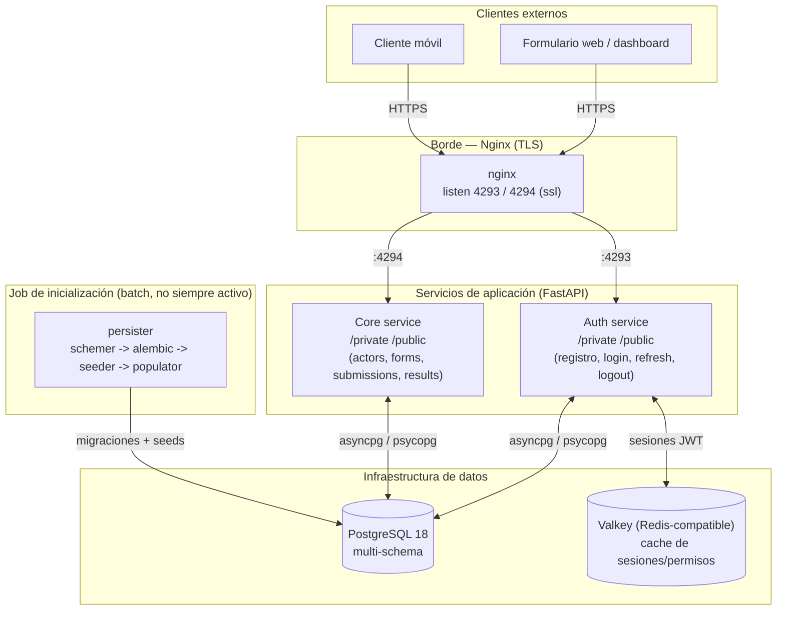
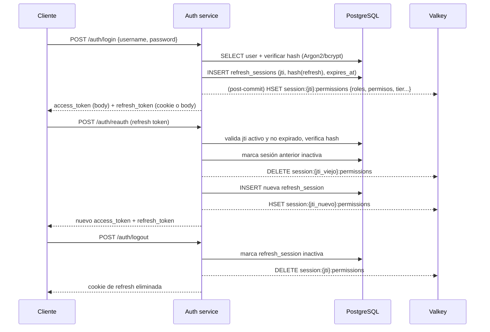
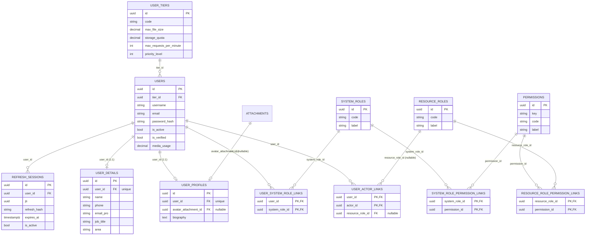
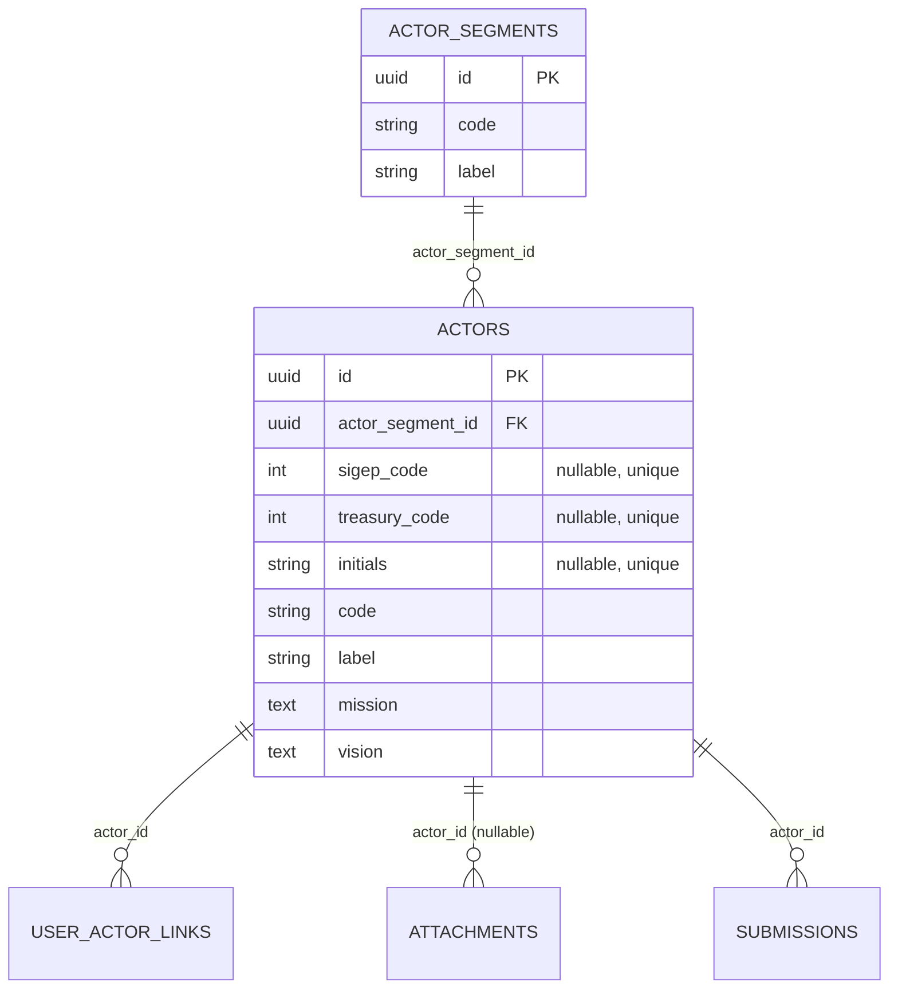
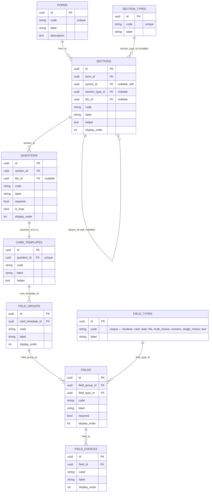
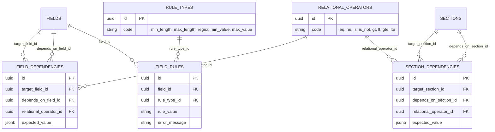
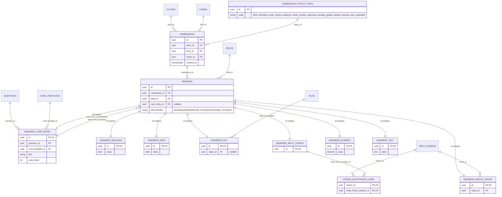
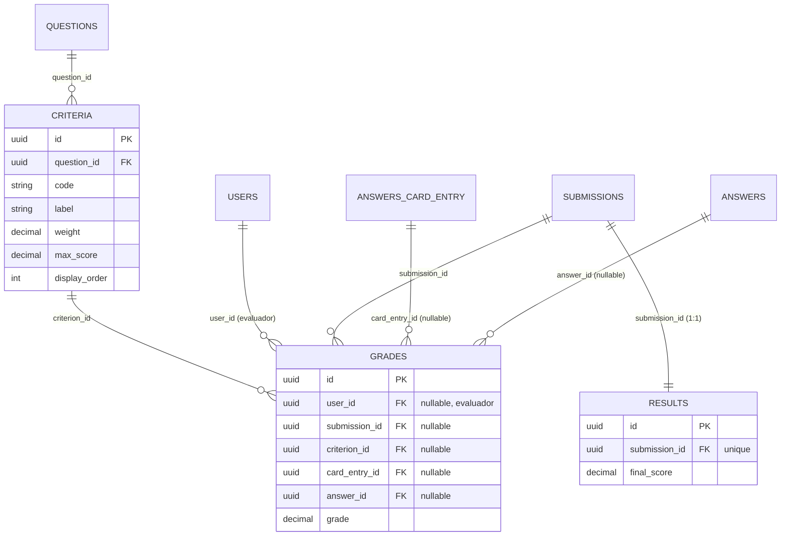
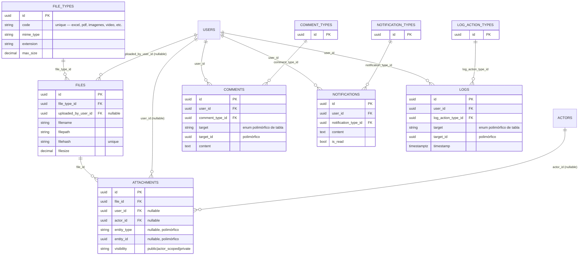

# Arquitectura del Backend — Índice de Innovación Pública (IIP)

> Documento técnico generado a partir de una revisión completa del código fuente del monorepo (`Auth`, `Core`, `Persistence`, `Packages/shared`) al 2026-08-20, rama `cambios-alejo`.

## 1. Contexto del producto

El **Índice de Innovación Pública (IIP)** es un instrumento de medición que evalúa el nivel de innovación de entidades públicas (distritales). Este repositorio implementa el **backend** de la plataforma que soporta ese instrumento: un sistema de **formularios dinámicos, jerárquicos y versionables** que las entidades (actores) diligencian, cuyas respuestas son luego calificadas por evaluadores contra criterios ponderados para producir un resultado agregado (el índice).

La intención declarada del proyecto es que la información se recolecte **a través de APIs** (no de un frontend acoplado): el backend expone dos superficies HTTP — una API pública y una privada — pensadas para ser consumidas por clientes externos (formularios web, integraciones, dashboards de resultados).

## 2. Visión general de la arquitectura

El sistema es un **monorepo multi-servicio** con diseño **Domain-Driven Design (DDD)** por capas (`routers → application → domain → infrastructure`), orquestado con Docker Compose. Hay tres servicios desplegables en Python/FastAPI/SQLAlchemy y un paquete compartido (`Packages/shared`) que centraliza modelos de datos, esquemas Pydantic, seguridad y utilidades.



Puntos clave del diseño:

- **Dos puntos de entrada HTTP independientes** (`auth` en el puerto `4293`, `core` en el puerto `4294`), cada uno detrás de Nginx con terminación TLS usando un certificado compartido (`Secrets/cert.crt` / `cert.key`).
- Cada servicio FastAPI expone **tres apps montadas**: `api` (raíz, healthcheck), `api/private` (pensada para consumo desde el propio frontend/Node, con `TrustedHostMiddleware`) y `api/public` (pensada para integraciones externas, CORS configurable vía `PUBLIC_ORIGINS`).
- El servicio `persister` **no corre como daemon**: su `Dockerfile` no define `CMD` y `compose.yaml` no le asigna `command:`. Se invoca puntualmente vía `docker compose run --rm persister ...` desde `Scripts/launcher.sh` (ver §7). Esto es intencional: es un runner de tareas de mantenimiento (migrar, sembrar datos, extraer plantillas, respaldar), no un proceso de larga duración.
- **Sin API Gateway/BFF** propio: Nginx solo hace *reverse proxy* TLS 1:1 a cada servicio; no hay agregación de rutas entre `auth` y `core`.

## 3. Servicios y responsabilidades

| Servicio | Rol | Puerto interno | Depende de |
|---|---|---|---|
| `Auth` | Identidad, emisión/validación de tokens JWT, sesiones, (adjuntos de archivos — deshabilitado) | `PORT_AUTH` (4293 en `.env` local) | `db`, `cache` |
| `Core` | Dominio de negocio: actores/entidades evaluadas, diseño de formularios, envíos (submissions), calificación, resultados | `PORT_CORE` (4294 en `.env` local) | `db`, `cache`, `auth` (arranque secuencial) |
| `Persistence` (`persister`) | Creación de esquemas (`schemer`), migraciones (`alembic`/`migrator`), datos de referencia (`seeder`), datos estructurales de formularios (`populator`), utilidades de extracción/backup | — (job puntual) | `db` |
| `Packages/shared` | Librería interna (no un servicio): motor de BD (SQLAlchemy async/sync), modelos ORM, enums de dominio, esquemas Pydantic base, JWT, hashing (Argon2/bcrypt), cifrado Fernet, logging | — | — |

Cada servicio de aplicación sigue la misma organización interna:

```
<Servicio>/src/
├── main.py                # Bootstrap FastAPI, CORS, montaje public/private
├── routers/                # Capa HTTP — validación de entrada, orquesta application/
├── application/             # Casos de uso — orquesta domain/ e infra (UoW, transacciones)
├── domain/
│   ├── services/            # Reglas de negocio puras
│   └── factories/            # (Core) construcción de entidades de respuesta polimórficas
├── infrastructure/
│   ├── repositories/         # Acceso a datos por agregado (extiende BaseRepository)
│   └── uow/                  # Unit of Work por caso de uso (transacción + repos + hooks)
└── schemas/                  # DTOs Pydantic específicos del servicio
```

`shared.db.UnitOfWork` es la pieza central: cada UoW especializado (`AuthUoW`, `IdentityUoW`, `FormDesignUoW`, `SubmissionUoW`, `Grading`UoW…) abre una `AsyncSession`, inicializa sus repositorios y, al salir del bloque `async with`, hace `commit`/`rollback` automático y ejecuta *post-commit hooks* — por ejemplo, escribir el mapa de permisos del usuario en Valkey solo si la transacción en Postgres fue exitosa (ver `Auth/src/infrastructure/uow/auth.py`).

## 4. Autenticación y autorización

### 4.1 Tokens

- **JWT firmado con Ed25519** (par de llaves asimétricas en `Secrets/jwt_private.pem` / `jwt_public.pem`, montadas como Docker secrets en `/run/secrets/jwt_private_key` y `/run/secrets/jwt_public_key`). No hay *fallback* por variable de entorno: si el secreto no está montado, el servicio falla al arrancar (`Packages/shared/src/shared/utils/tokens/config.py`).
- **Access token**: vida corta (`JWT_EXPIRE_MINUTES_ACCESS`, 30 min por defecto), viaja en el header `Authorization: Bearer`, se valida en cada request (`AccessContext`).
- **Refresh token**: vida larga (`JWT_EXPIRE_MINUTES_REFRESH`, 7 días por defecto), incluye un `jti` (UUIDv7) y se persiste **hasheado** en la tabla `auth.refresh_sessions` para poder revocarlo.
- **Doble estrategia cliente/servidor según plataforma** (header `X-Platform: web|mobile`):
  - `web`: el refresh token se entrega como cookie `httpOnly` + `Secure` (en producción) + `SameSite=strict`; nunca se expone al JS del navegador.
  - `mobile`: el refresh token se entrega en el cuerpo de la respuesta y se reenvía en el header `X-Refresh-Token` (no hay cookies). Hay una verificación anti-spoofing: si `X-Platform: mobile` viene acompañado de `Origin`/`Referer` (propios de un navegador), la petición se rechaza.

### 4.2 Flujo login / refresh / logout



Notas importantes de seguridad detectadas en el código:

- El login usa un **hash señuelo** (`DUMMY_HASH`) cuando el usuario no existe, para que `verify_password` siempre corra y el tiempo de respuesta no delate si el username existe (mitigación de *timing/enumeration attack*) — buena práctica ya implementada.
- Las contraseñas se hashean con Argon2/bcrypt (`passlib`/`argon2-cffi`), nunca en texto plano.
- El registro (`POST /auth/register`) **activa la cuenta inmediatamente** (`is_active=True`) sin verificación de correo — no hay flujo de verificación de email implementado todavía pese a existir el campo `User.is_verified`.

### 4.3 Modelo de autorización: RBAC + ReBAC híbrido

El sistema combina dos modelos de control de acceso sobre la misma entidad `User`:

- **RBAC global** (`system_roles` + `permissions` vía `user_system_role_links` / `system_role_permission_links`): roles de plataforma como `admin`, `form_builder`, `grader`, `auditor`, `standard_user` (`shared/enums/auth.py`).
- **ReBAC por recurso** (`resource_roles` + `permissions` vía `user_actor_links` / `resource_role_permission_links`): un usuario puede tener un rol *distinto por cada `Actor`* (entidad evaluada) al que está vinculado — `owner`, `editor`, `evaluator`, `commenter`, `viewer`.
- **ABAC de cuotas** vía `UserTier` (`root`, `admin`, `premium`, `standard`, `guest`): límites de tamaño de archivo, cuota de almacenamiento, *rate limit* y prioridad.

Al emitir tokens, `PermissionCompiler.compile()` (`Auth/src/domain/services/token/tokens.py`) **aplana todo ese grafo de permisos en un solo hash de Valkey** (`session:{jti}:permissions`) con roles globales, permisos globales, permisos por actor y límites de tier — así los servicios pueden autorizar cada request con una sola lectura O(1) a Valkey en vez de recorrer el grafo relacional en cada petición. *(Nota: en el código actual del router de `Core`, esta verificación de permisos contra Valkey aún no se invoca explícitamente en los endpoints — se extraen los `claims` del JWT pero no se ve una llamada a Valkey/`get_claims` con chequeo de permisos; ver §6 gaps).*

## 5. Superficie de API

### 5.1 Auth service (`/public/auth`, prefijo montado bajo `api_public`)

| Método | Ruta | Función |
|---|---|---|
| `POST` | `/auth/register` | Crea un usuario nuevo (tier por defecto, activo de inmediato) |
| `POST` | `/auth/login` | Autentica y emite access+refresh token |
| `POST` | `/auth/reauth` | Rota el refresh token y emite un nuevo par |
| `POST` | `/auth/logout` | Revoca el refresh token activo |

`Auth/src/routers/files.py` existe pero está **completamente comentado** (endpoints de subida/lectura/edición/borrado de archivos) — funcionalidad planeada, no operativa.

### 5.2 Core service

| Método | Ruta | Función | Montado en `main.py` |
|---|---|---|---|
| `GET` | `/actors/all` | Lista actores (entidades evaluadas) | Sí |
| `GET` | `/actors/{id}` | Detalle de un actor + su segmento | Sí |
| `POST` | `/actors/new` | Crea un actor | Sí |
| `DELETE` | `/actors/delete/{id}` | Elimina un actor | Sí |
| `GET` | `/actor_segments/all` | Lista segmentos de actores | Sí |
| `GET` | `/actor_segments/{id}` | Detalle de segmento + sus actores | Sí |
| `POST` | `/actor_segments/new` | Crea un segmento | Sí |
| `DELETE` | `/actor_segments/delete/{id}` | Elimina un segmento | Sí |
| `POST` | `/submissions/forms/{form_id}` | Crea un envío de respuestas para un formulario | Sí |
| `POST` | `/forms` | Crea un formulario completo (form→sections→questions→card_template→field_groups→fields→choices) | Sí (corregido el 2026-08-20, ver §6 y §8.3) |
| `GET` | `/results/get/one` | Obtener una edición de índice/resultado | **No** (`routers/results.py`, cuerpo vacío) |

Todas las rutas de `Core` requieren `AccessContext` (Bearer JWT), pero **ningún endpoint valida permisos RBAC/ReBAC todavía** — solo se decodifica el token para obtener `user_id`; la autorización granular (¿puede este usuario crear un `Actor`? ¿pertenece a este `Actor`?) no está implementada en la capa de routers/aplicación.

## 6. Estado de implementación — hallazgos relevantes

Esta sección documenta honestamente lo que el código refleja hoy, para evitar asumir que todo lo modelado está operativo:

| Área | Estado | Detalle |
|---|---|---|
| `POST /forms` (`Core/src/routers/forms.py`) | **Corregido y montado** (2026-08-20) | Los archivos `routers/alejo.py`/`application/alejo.py`/`domain/services/alejo.py` (nombrados así por el autor original) y el duplicado muerto `routers/forms.py`/`application/form_design.py` se consolidaron en un único flujo `routers/forms.py → application/forms.py → domain/services/forms.py`, ya montado en `main.py`. El esquema de request (`schemas/forms.py`) ahora usa `code`/`label`/`description` (igual que las columnas reales) en vez de los inventados `anno`/`title`, y anida `field_groups` dentro de `card_template` (antes colgaban directo de `question`, que no es como está la FK real). Ver §8.3 para la forma exacta del JSON. |
| `Core/src/routers/results.py` | **Stub vacío** | El endpoint no tiene cuerpo (`pass` implícito), no está montado. |
| `Auth/src/routers/files.py` | **Sin implementar** | Todo el CRUD de archivos está comentado. |
| `grading.Assignment` | **Declarado, no modelado** | `TargetTable.ASSIGNMENTS` existe como referencia de tabla y hay un campo `assignment_id` comentado en `Criterion`, pero no existe una clase `Assignment` ni migración para ella. |
| `forms.Information` (`TargetTable.INFORMATIONS`) | **Declarado, no modelado** | Igual que arriba: tabla nombrada en `targets.py`, sin clase ORM. |
| `persister` (Docker service) | **Sin proceso por defecto** | No tiene `CMD`; se opera exclusivamente vía `Scripts/launcher.sh` (`--setup`, `--schemer`, `--migrator`, `--seeder`, `--populator`, `--extract`, `--backup`, `--restore`). |
| Autorización granular en `Core` | **No implementada** | Los routers extraen `claims` del JWT pero no consultan el mapa de permisos de Valkey ni verifican pertenencia a un `Actor` antes de mutar datos. |
| Verificación de email | **No implementada** | `User.is_verified` existe en el modelo pero ningún flujo lo cambia de `False`. |

## 7. Pipeline de despliegue e inicialización

1. **Generación de secretos** (`Scripts/secrets.sh`): certificado TLS autofirmado, par de llaves Ed25519 para JWT, `.env` y `users.toml` desde plantillas. (Ver conversación previa de esta sesión: además de lo que genera este script, `compose.yaml` requiere archivos de secreto adicionales — `postgres_password`, `valkey_password`, `fernet_password`, `github_token_*`, `nginx.conf` — que deben materializarse en `./Secrets/` antes de `docker compose up`.)
2. **Build en dos capas**: la imagen base `docker.io/labcapital/apps:app-base` (definida por el `Dockerfile` raíz — instala `Packages/shared` y dependencias comunes) debe construirse **antes** que `Auth`, `Core` y `Persistence`, ya que sus Dockerfiles parten `FROM docker.io/labcapital/apps:app-base` esperando la imagen local.
3. **Inicialización de datos** (`Scripts/launcher.sh --setup`), ejecutada como contenedores efímeros (`docker compose run --rm persister ...`) en este orden estricto:
   1. `schemer.py` → crea los *schemas* de Postgres (`auth`, `reference`, `forms`, `submissions`, `grading`, `links`, `files`, `interactions`, `audit`, `actors`, `rules`) vía `CREATE SCHEMA IF NOT EXISTS`.
   2. `alembic upgrade head` → aplica la migración estructural (tablas, FKs, índices). Versión de esquema controlada en la tabla `alembic_automatic_version`.
   3. `seeder.py` → carga datos de referencia atómicos (tipos de log, tipos de archivo, permisos, roles de sistema/recurso, tiers, tipos de regla/operador, estado de envíos, tipo de campo, tipos de notificación/comentario, usuario inicial) desde `Persistence/src/seeder/seeds/*.py`, cada uno con una función `upgrade()` ejecutada en orden alfabético del nombre de archivo.
   4. `populator.py` → carga la **estructura real de formularios** (sectores, entidades, tipos de sección, formularios, secciones, preguntas, tarjetas, grupos de campo, campos, opciones, dependencias, reglas, criterios de calificación) desde `Persistence/src/populator/pops/*.py`, también por convención `upgrade()`. Este paso además valida credenciales de un usuario "root" leído de `Secrets/users.toml` y usa `httpx` (sugiere que al menos parte de la población se hace *vía la propia API HTTP* en lugar de escritura directa a BD — coherente con la intención de "recolección de información a través de APIs").
4. Solo después de este pipeline se levantan los servicios de aplicación (`docker compose up -d`).

Herramientas adicionales de `launcher.sh`: `--revision` (autogenera migraciones Alembic comparando modelos vs. BD activa), `--extract` (vuelca cada tabla del metadata de SQLAlchemy a una plantilla CSV, útil para preparar datos de carga), `--backup`/`--restore` (dump/restore de Postgres vía `pg_dump`/`psql`).

## 8. Modelo de base de datos

La base de datos usa **un esquema de PostgreSQL por dominio** (no un único `public`), con UUID (`uuid7`/`gen_random_uuid()`) como clave primaria en todas las tablas, y columnas de auditoría (`updated_at`, y en algunas `created_at`) generadas por convención en `Packages/shared/src/shared/db/column_abstractions.py`.

Resumen de esquemas:

| Schema Postgres | Contenido |
|---|---|
| `reference` | Catálogos/listas de valores: tipos de log, archivo, tier, rol, permiso, comentario, notificación, campo, operador relacional, regla, estado de envío |
| `auth` | Identidad: usuarios, sesiones de refresh, detalles y perfil |
| `actors` | Entidades evaluadas (actores) y sus segmentos |
| `links` | Tablas de unión N:N (RBAC, ReBAC, opciones múltiples) |
| `interactions` | Comentarios y notificaciones |
| `audit` | Bitácora de actividad |
| `files` | Almacenamiento de archivos y adjuntos contextuales |
| `forms` | Estructura jerárquica del formulario (form → section → question → card_template → field_group → field → field_choice) |
| `rules` | Dependencias condicionales y reglas de validación sobre campos/secciones |
| `submissions` | Envíos y respuestas (con herencia por tabla concreta según tipo de campo) |
| `grading` | Criterios de evaluación, calificaciones y resultado agregado |

A continuación, los diagramas entidad-relación agrupados por dominio (los atributos mostrados son los relevantes para las relaciones; todas las tablas tienen además `id uuid PK` y, salvo indicación, `updated_at timestamptz`).

### 8.1 Auth — identidad, roles y permisos



### 8.2 Actores (entidades evaluadas)



### 8.3 Diseño de formularios



> Nota: cada `Question` tiene siempre exactamente un `CardTemplate` asociado (relación 1:1 obligatoria) que a su vez agrupa los `FieldGroup`/`Field` que se repiten cuando `is_loop=true` (p. ej. una pregunta tipo "liste sus proyectos de innovación" con tarjetas repetibles).

### 8.4 Reglas y dependencias condicionales



Esto implementa **visibilidad condicional** ("mostrar la pregunta X solo si la respuesta a Y cumple el operador Z contra `expected_value`") tanto a nivel de campo individual como de sección completa.

### 8.5 Envíos y respuestas (herencia por tabla concreta)



Patrón usado: **`Answer` es una tabla base polimórfica** (`__mapper_args__ = {"polymorphic_on": "discriminator"}`) y cada tipo de campo (`FieldTypesEnum`) tiene su propia tabla de valor con `id` que es a la vez PK y FK hacia `answers.id` (herencia *joined-table* de SQLAlchemy). `AnswerCardEntry` es un caso especial: además de ser un subtipo de `Answer`, actúa como *contenedor* de otras respuestas (`card_entry_id`) para modelar las preguntas repetibles tipo tarjeta.

### 8.6 Calificación y resultados



`Result.final_score` es el **índice agregado y ponderado por envío** — el resultado final que consume el instrumento de medición IIP. `Criterion.weight` define cómo se pondera cada criterio dentro de una pregunta al calcular ese agregado (el cálculo de agregación en sí no se encontró implementado en el código revisado — no hay un servicio `ResultService`/`GradingService` con lógica de ponderación).

### 8.7 Archivos, interacciones y auditoría



`Attachment`, `Comment` y `ActivityLog` usan **asociación polimórfica** (`entity_type`/`entity_id` o `target`/`target_id`, sin FK real de Postgres) para poder referenciar cualquier entidad del sistema (un formulario, un envío, un actor…) desde una sola tabla, a costa de no poder validar la integridad referencial a nivel de base de datos — es responsabilidad de la capa de aplicación mantenerla consistente.

## 9. Stack tecnológico

| Categoría | Tecnología |
|---|---|
| Lenguaje / runtime | Python ≥ 3.12 |
| Framework HTTP | FastAPI + Uvicorn |
| ORM / migraciones | SQLAlchemy 2.x (async con `asyncpg`, sync con `psycopg`) + Alembic |
| Base de datos | PostgreSQL 18 (multi-schema) |
| Cache / sesiones | Valkey (compatible con Redis), cliente `valkey` async |
| Autenticación | JWT (Ed25519) vía `joserfc`, hashing `passlib`/`argon2-cffi`/`bcrypt` |
| Cifrado simétrico | Fernet (`cryptography`) para datos sensibles en reposo |
| Validación / DTOs | Pydantic v2 |
| Empaquetado | `uv` (workspace: `Packages/shared` como dependencia local) |
| Contenedores | Docker / Podman Compose, imagen base compartida multi-stage |
| Proxy / TLS | Nginx (terminación TLS, *reverse proxy* por puerto) |
| Gestión de secretos | Docker secrets (archivos en `./Secrets/`) + SOPS/age para el almacén cifrado (`secrets.yaml`) |
| Reproducibilidad de entorno dev | Nix Flakes + direnv (opcional) |

## 10. Resumen de recomendaciones

1. ~~Cerrar el endpoint de creación de formularios~~ — hecho el 2026-08-20 (`routers/forms.py` + `application/forms.py` + `domain/services/forms.py`).
2. **Implementar la verificación de autorización** en los routers de `Core` (RBAC/ReBAC contra el hash de Valkey) — hoy solo se valida que el JWT sea válido, no qué puede hacer ese usuario.
3. **Definir el servicio de agregación de resultados** (`Result.final_score` a partir de `Grade`/`Criterion.weight`) — no se encontró lógica de cálculo implementada.
4. **Formalizar el arranque de `persister`** en el pipeline de despliegue (documentar o automatizar que `--setup` debe correr antes de exponer el servicio a tráfico), ya que hoy depende de que un operador humano ejecute `launcher.sh` en el orden correcto.
5. Revisar si `forms.Information` y `grading.Assignment`, declarados como referencias de tabla pero sin modelo ORM, siguen siendo necesarios para el instrumento o se pueden retirar del `targets.py`.
